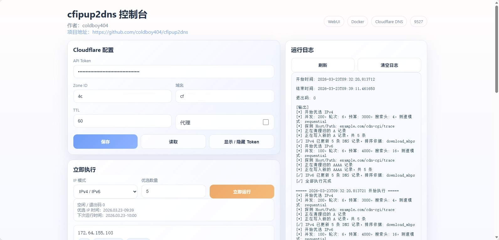
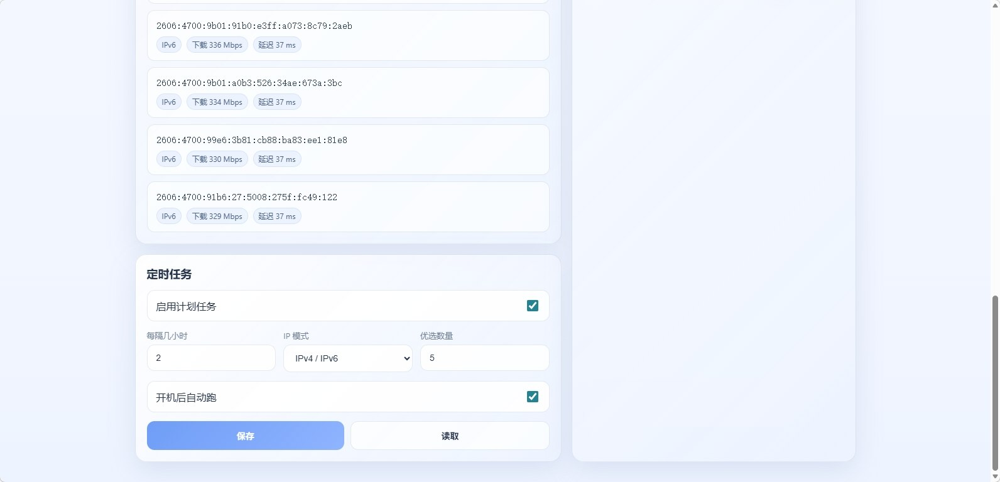

# cfipup2dns

一个面向国内服务器环境的 **Cloudflare 优选 IP 自动 DDNS** 项目。

现在支持：

- ✅ Docker 一体化部署
- ✅ WebUI 图形管理（默认端口 `9527`）
- ✅ 手动一键优选并更新 DNS
- ✅ 定时任务管理
- ✅ 在线查看运行日志
- ✅ 展示已优选出的 IPv4 / IPv6、下载速度、延迟
- ✅ 默认接入上游 `montecarlo-ip-searcher` 的较新版本与顺序测速模式

---

## 项目主页

- 本项目 GitHub: https://github.com/coldboy404/cfipup2dns
- 原项目 / 上游项目 GitHub: https://github.com/Leo-Mu/montecarlo-ip-searcher

---

## 界面预览




---

## 快速部署

推荐直接使用（国内建议先挂代理部署，优选时关闭代理）：

```bash
git clone https://gh-proxy.org/https://github.com/coldboy404/cfipup2dns.git
cd cfipup2dns
bash docker/up.sh
```

启动后访问：

- `http://你的服务器IP:9527`

后续更新：

```bash
cd ~/cfipup2dns && git pull --ff-only && bash docker/up.sh
```

---

## Web 面板功能

### 1. Cloudflare 配置
可在页面直接配置并保存：

- API Token
- Zone ID
- 域名
- TTL
- 是否代理

### 2. 立即执行
支持手动触发优选：

- `IPv4`
- `IPv6`
- `IPv4 / IPv6`

并可设置 **优选数量**。

运行完成后，页面会展示：

- IP 地址
- IP 类型（IPv4 / IPv6）
- 下载速度
- 延迟

### 3. 定时任务
支持页面直接设置：

- 是否启用
- 每隔几小时运行
- IP 模式
- 优选数量
- 开机后自动跑

### 4. 运行日志
日志会尽量中文化展示；底层工具原始输出无法翻译时，保留英文原文。

---

## 与上游项目的差异

本项目基于 `Leo-Mu/montecarlo-ip-searcher` 做了封装，重点增加：

- WebUI 配置管理
- Cloudflare DNS 自动写入
- 定时任务
- 结果持久化
- 面板化展示

当前策略已改为直接跟随上游源码能力：

- 默认同步上游 `Leo-Mu/montecarlo-ip-searcher` 的 **`main` 分支源码**
- 在**容器启动初始化阶段**预编译 `mcis`
- 运行任务阶段只负责扫描与更新 DNS，不再临时下载源码/编译
- 明确启用 `--download-mode sequential`

这样可以避免 release 包能力滞后，也能减少运行时因网络波动导致的失败。

---

## 数据目录

`docker-compose.yml` 默认挂载：

- `./data:/data`

主要内容包括：

- 配置文件：`/data/project/config.json`
- 优选结果：`/data/project/best_ips_v4.json`
- 优选结果：`/data/project/best_ips_v6.json`
- 定时任务：`/data/cron/cfip.cron`
- 日志目录：`/data/logs/`

---

## 常用命令

```bash
# 启动 / 重建
bash docker/up.sh

# 查看日志
docker compose logs -f

# 停止
docker compose down
```

---

## 作者与说明

- 作者：**coldboy404**、**gemini**、**chatgpt**
- 说明：本项目用于 Cloudflare DNS 优选 IP 自动更新，重点优化国内服务器的一键部署和面板化管理体验。
- 特别鸣谢：上游项目 GitHub: https://github.com/Leo-Mu/montecarlo-ip-searcher
